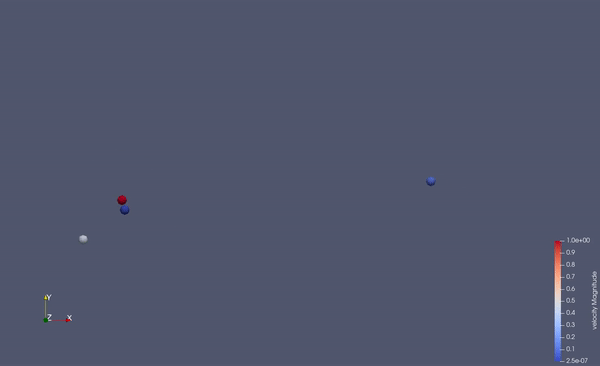
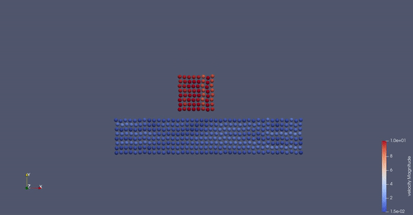
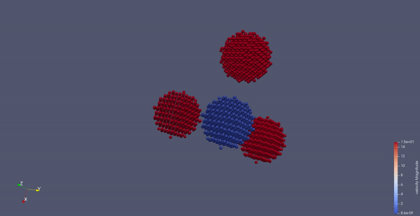
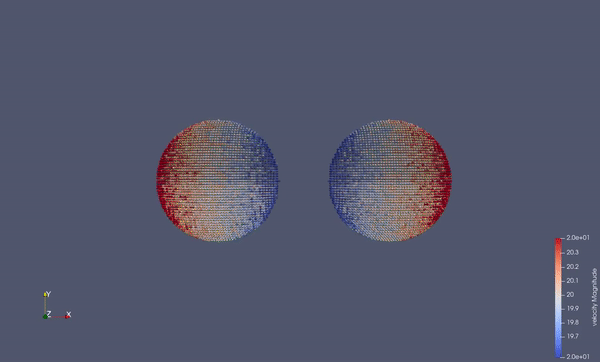
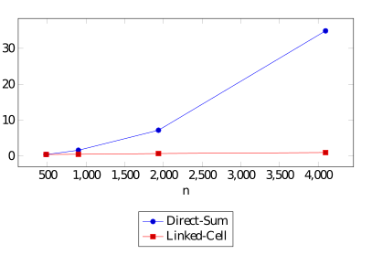

# MolSim


## Description

Part of a practical course on molecular dynamics at TU Munich (IN0012). Based on a template provided
at [TUM-I5/MolSim](https://github.com/TUM-I5/MolSim).

Application for molecular simulations.

## Getting Started

Checkout the sources.

```bash
$ git clone git@github.com:Dominik-Weinzierl/MolSim.git
$ cd MolSim
```

### Prerequisites

- [cmake](https://cmake.org/) (3.21.4)
- [gcc](https://gcc.gnu.org/) (11.1.0)
- _(optional)_ [clion](https://www.jetbrains.com/clion/)
- _(optional)_ [paraview](https://www.paraview.org/) (5.9.1)

## Run application

### Build
> The building process can take a while! Please be patient.

#### Available build options:

- `BUILD_DOCUMENTATION`: Enables build of doxygen documentation (`default`: off)
- `BUILD_TESTS`: Enable build of tests (`default`: off)

#### Using the Makefile:

1. Create `build` folder and run cmake with make.
    ```bash
    $ make
    ```
   *Existing `build` folder will be deleted and created again.

2. Switch into your build folder.
   ```bash
   $ cd ./build
   ```
3. Create the `MolSim` target with the generated Makefile.
   ```bash
   $ make
   ```

#### Using CMake:

1. Create `build` folder (`in-source-builds` are disabled).
    ```bash
    $ mkdir ./build
    ```
2. Switch into your `build` folder.
   ```bash
   $ cd ./build
   ```
3. Run `cmake` with specified arguments.
   ```bash
   $ cmake .. -D BUILD_DOCUMENTATION=OFF -D BUILD_TESTS=OFF -D CMAKE_C_COMPILER=gcc -D CMAKE_CXX_COMPILER=g++
   ```
4. Create the MolSim target with the generated Makefile.
   ```bash
   $ make
   ```

### Perform simulations

> To perform simulations in `2D` or `3D`, please add the corresponding flag (`-2` | `-3`) as an argument. For more details see the following examples.

Run `./MolSim` without any arguments to list possible and required arguments.

   ```bash
    $ ./MolSim
  
    Usage: ./MolSim [-h | --help] | {-f | --filename} <filename> {-t | --t_end} <t_end> {-d | --delta_t} <delta_t> [-o | --output <output>] [-i | --iteration <iteration>] [-w | --writer {vtk | xyz}] [-p | --physics {gravitation | lennard}] [-b | --benchmark] [-2 | -3]
    Options:
            -h,--help               Show this help message
            -f,--filename           Specify the input filename
            -t,--t_end              Specify the end time of this simulation
            -d,--delta_t            Specify the time steps per calculation
            -o,--output             Specify the output filename
            -i,--iteration          Specify the iteration
            -w,--writer             Specify the writer used for the output files
            -p,--physics            Specify the physics used for the simulation
            -b,--benchmark          Run simulation as benchmark
            -2,-3                   Specify the domain of the simulation (default: 3D)
    
    Usage: ./MolSim {-x | --xml} {-f | --filename <filename>} [-b | --benchmark] [-2 | -3]
    Options:
            -f,--filename           Specify the input filename as xml
            -b,--benchmark          Run simulation as benchmark
            -2,-3                   Specify the domain of the simulation (default: 3D)


   ```

#### Worksheet 1:

- Run example simulation of `Task 3`.
   ```bash
   $ ./MolSim --filename ../../input/ws_01/eingabe-sonne.txt --t_end 1000 --delta_t 0.014 --physics gravitation 
   ```
  
- _(optional)_ Run additional simulation of the solar system.
   ```bash
   $ ./MolSim -f ../../input/ws_01/sun_system.txt -t 1000 -d 0.014 -p gravitation 
   ```
- _(optional)_ Run example simulation of `Task 3` as benchmark.
   ```bash
   $ ./MolSim --filename ../../input/ws_01/eingabe-sonne.txt --t_end 1000 --delta_t 0.014 --physics gravitation --benchmark
   ```

#### Worksheet 2:

- Run example simulation of `Task 3`.
   ```bash
   $ ./MolSim -x -f ../../input/ws_02/input_task_3.xml -2
   ```
  
- _(optional)_ Run example simulation of `Task 3` as benchmark.
   ```bash
   $ ./MolSim -x -f ../../input/ws_02/input_task_3.xml -b -2
   ```
- _(optional)_ Run example simulation of `Task 3` as `3D` simulation.
   ```bash
   $ ./MolSim -x -f ../../input/ws_02/input_task_3.xml -3
   ```
- Input file used for simulation of `Task 3`.
  ```xml
    <Simulation endTime="5" deltaT="0.0002" iteration="60" physics="lennard" writer="vtk" output="MD">
        <Shapes>
            <Cuboid mass="1.0" distance="1.1225" meanValue="0.1" packed="true" depthOfPotentialWell="5" zeroCrossing="1">
                <Position x="0.0" y="0.0" z="0.0"/>
                <Velocity x="0.0" y="0.0" z="0.0"/>
                <Dimension x="40" y="8" z="1"/>
            </Cuboid>
            <Cuboid mass="1.0" distance="1.1225" meanValue="0.1" packed="true" depthOfPotentialWell="5" zeroCrossing="1">
                <Position x="15.0" y="15.0" z="0.0"/>
                <Velocity x="0.0" y="-10.0" z="0.0"/>
                <Dimension x="8" y="8" z="1"/>
            </Cuboid>
        </Shapes>
    </Simulation>
   ```

#### Worksheet 3:

- Run example simulation of `Task 2`.
   ```bash
   $ ./MolSim -x -f ../../input/ws_03/task_2_linked.xml -2
   ```
  
- _(optional)_ Run example simulation of `Task 2` as direct sum simulation.
   ```bash
   $ ./MolSim -x -f ../../input/ws_03/task_2_direct.xml -2
   ```
- _(optional)_ Run example simulation of `Task 2` as benchmark.
   ```bash
   $ ./MolSim -x -f ../../input/ws_03/task_2_linked.xml -b -2
   ```
- _(optional)_ Run example simulation of `Task 2` as `3D` simulation.
   ```bash
   $ ./MolSim -x -f ../../input/ws_03/task_2_linked.xml -3
   ```
- Input file used for simulation of `Task 2`.
  ```xml
    <Simulation endTime="20" deltaT="0.0005" iteration="60" physics="lennard" writer="vtk" output="MD">
        <Strategy>
            <LinkedCell cutoffRadius="3">
                <Domain x="180" y="90" z="9"/>
                <CellSize x="3" y="3" z="3"/>
                <Boundary boundary="outflow"/>
            </LinkedCell>
        </Strategy>
        <Shapes>
            <Cuboid mass="1.0" distance="1.1225" meanValue="0.1" packed="true" depthOfPotentialWell="5" zeroCrossing="1">
                <Position x="20.0" y="20.0" z="1.0"/>
                <Velocity x="0.0" y="0.0" z="0.0"/>
                <Dimension x="100" y="20" z="1"/>
            </Cuboid>
            <Cuboid mass="1.0" distance="1.1225" meanValue="0.1" packed="true" depthOfPotentialWell="5" zeroCrossing="1">
                <Position x="70" y="60" z="1.0"/>
                <Velocity x="0.0" y="-10.0" z="0.0"/>
                <Dimension x="20" y="20" z="1.0"/>
            </Cuboid>
        </Shapes>
    </Simulation>
   ```
- Run example simulation of `Task 4`.
   ```bash
   $ ./MolSim -x -f ../../input/ws_03/water_drop.xml -2
   ```
  
- _(optional)_ Run example simulation of `Task 4` as benchmark.
   ```bash
   $ ./MolSim -x -f ../../input/ws_03/water_drop.xml -b -2
   ```
- _(optional)_ Run example simulation of `Task 4` as `3D` simulation.
   ```bash
   $ ./MolSim -x -f ../../input/ws_03/water_drop.xml -3
   ```
- Input file used for simulation of `Task 4`.
  ```xml
    <Simulation endTime="10" deltaT="0.00005" iteration="120" physics="lennard" writer="vtk" output="MD">
        <Strategy>
            <LinkedCell cutoffRadius="3">
                <!-- Domain size needs to be a multiple of Cell size -> we adapted the Domain size to 51 -->
                <Domain x="120" y="51" z="51"/>
                <CellSize x="3" y="3" z="3"/>
                <Boundary boundary-bottom="reflecting"/>
            </LinkedCell>
        </Strategy>
        <Shapes>
            <Sphere mass="1.0" distance="1.1225" meanValue="0.1" radius="15" packed="true" depthOfPotentialWell="5" zeroCrossing="1">
                <Center x="60.0" y="25.0" z="25.0"/>
                <Velocity x="0.0" y="-10.0" z="0.0"/>
            </Sphere>
        </Shapes>
    </Simulation>
    ```

### Benchmarks

Disable all `spdlog` outputs to get best results. Therefore add `-D WITH_SPD_LOG_OFF=OFF` to your cmake command. (
Default: disabled)

### Logging

Additional cmake options:

- `WITH_SPD_LOG_OFF` "Disable logger" ON
- `WITH_SPD_LOG_TRACE` "Log level: Trace" OFF
- `WITH_SPD_LOG_DEBUG` "Log level: Debug" OFF
- `WITH_SPD_LOG_INFO` "Log level: Info" OFF
- `WITH_SPD_LOG_WARN` "Log level: Warn" OFF
- `WITH_SPD_LOG_ERROR` "Log level: Error" OFF
- `WITH_SPD_LOG_CRITICAL` "Log level: Critical" OFF

### Tests

- Run `cmake` in `build` folder with specified arguments.
   ```bash
   $ cmake .. -D BUILD_DOCUMENTATION=OFF -D BUILD_TESTS=ON -D CMAKE_C_COMPILER=gcc -D CMAKE_CXX_COMPILER=g++
   ```
- Run `make` in `source` folder with specified arguments.
   ```bash
   $ make build_with_test
   ```

1. Run `make` in `build` folder to build target.
   ```bash
   $ make 
   ```
2. Run tests in `build` folder to verify correctness.
    ```bash
    $ ctest
    [...]
    100% tests passed, 0 tests failed out of 108
    
    Total Test time (real) =   38.84 sec
    ```

### Input file format

- XSD - Definition of xml file structure

    ```xml
    <?xml version="1.0"?>
    <xsd:schema xmlns:xsd="http://www.w3.org/2001/XMLSchema">
        <!-- Cuboids - all attributes are required -->
        <xsd:complexType name="cuboid_t">
            <xsd:sequence>
                <xsd:element name="Position" type="vector_t"/>
                <xsd:element name="Velocity" type="vector_t"/>
                <xsd:element name="Dimension" type="vector_i"/>
            </xsd:sequence>
            <xsd:attribute name="distance" type="xsd:double" use="required"/>
            <xsd:attribute name="mass" type="xsd:double" use="required"/>
            <xsd:attribute name="meanValue" type="xsd:double" use="required"/>
            <xsd:attribute name="packed" type="xsd:boolean" use="required"/>
        </xsd:complexType>
        <!-- Spheres - all attributes are required -->
        <xsd:complexType name="sphere_t">
            <xsd:sequence>
                <xsd:element name="Center" type="vector_t"/>
                <xsd:element name="Velocity" type="vector_t"/>
            </xsd:sequence>
            <xsd:attribute name="radius" type="xsd:nonNegativeInteger" use="required"/>
            <xsd:attribute name="distance" type="xsd:double" use="required"/>
            <xsd:attribute name="mass" type="xsd:double" use="required"/>
            <xsd:attribute name="meanValue" type="xsd:double" use="required"/>
            <xsd:attribute name="packed" type="xsd:boolean" use="required"/>
        </xsd:complexType>
    
        <!-- Double vector - all attributes are required -->
        <xsd:complexType name="vector_t">
            <xsd:attribute name="x" type="xsd:double" use="required"/>
            <xsd:attribute name="y" type="xsd:double" use="required"/>
            <xsd:attribute name="z" type="xsd:double" use="required"/>
        </xsd:complexType>
    
        <!-- Integer vector - all attributes are required -->
        <xsd:complexType name="vector_i">
            <xsd:attribute name="x" type="xsd:nonNegativeInteger" use="required"/>
            <xsd:attribute name="y" type="xsd:nonNegativeInteger" use="required"/>
            <xsd:attribute name="z" type="xsd:nonNegativeInteger" use="required"/>
        </xsd:complexType>
    
        <!-- Sources - additional files -->
        <xsd:complexType name="input_t">
            <xsd:attribute name="path" type="xsd:string" use="required"/>
        </xsd:complexType>
    
        <!-- boundary_t - boundary options -->
        <xsd:complexType name="boundary_t">
            <xsd:attribute name="boundary" type="xsd:string"/>
            <xsd:attribute name="boundary-right" type="xsd:string"/>
            <xsd:attribute name="boundary-left" type="xsd:string"/>
            <xsd:attribute name="boundary-top" type="xsd:string"/>
            <xsd:attribute name="boundary-bottom" type="xsd:string"/>
            <xsd:attribute name="boundary-back" type="xsd:string"/>
            <xsd:attribute name="boundary-front" type="xsd:string"/>
        </xsd:complexType>
    
        <!-- List of Shapes (Cuboids/Spheres) -->
        <xsd:complexType name="shape_t">
            <xsd:sequence>
                <xsd:element name="Cuboid" type="cuboid_t" minOccurs="0" maxOccurs="unbounded"/>
                <xsd:element name="Sphere" type="sphere_t" minOccurs="0" maxOccurs="unbounded"/>
            </xsd:sequence>
        </xsd:complexType>
    
        <!-- Direct sum simulation -->
        <xsd:complexType name="directSum_t"/>
    
        <!-- Linked cell simulation -->
        <xsd:complexType name="linkedCell_t">
            <xsd:sequence>
                <!-- Boundary: specify at which boundary of the domain which type of condition is applied -->
                <xsd:element name="Boundary" type="boundary_t"/>
                <!-- Domain: size of the domain -->
                <xsd:element name="Domain" type="vector_i"/>
                <!-- Domain: size of the domain -->
                <xsd:element name="CellSize" type="vector_i"/>
            </xsd:sequence>
            <!-- cutoffRadius: used for linked cell optimizations -->
            <xsd:attribute name="cutoffRadius" type="xsd:double" use="required"/>
        </xsd:complexType>
    
        <xsd:complexType name="strategy_t">
            <xsd:choice>
                <xsd:element name="LinkedCell" type="linkedCell_t"/>
                <xsd:element name="DirectSum" type="directSum_t"/>
            </xsd:choice>
        </xsd:complexType>
    
        <!-- Simulation -->
        <xsd:complexType name="simulation_t">
            <xsd:sequence>
                <xsd:element name="Shapes" type="shape_t" minOccurs="0" maxOccurs="unbounded"/>
                <xsd:element name="Source" type="input_t" minOccurs="0" maxOccurs="unbounded"/>
                <xsd:element name="Strategy" type="strategy_t" minOccurs="0"/>
            </xsd:sequence>
            <xsd:attribute name="endTime" type="xsd:double" use="required"/>
            <xsd:attribute name="deltaT" type="xsd:double" use="required"/>
            <xsd:attribute name="output" type="xsd:string" use="required"/>
            <xsd:attribute name="iteration" type="xsd:nonNegativeInteger" use="required"/>
            <!-- writer: gravitation | lennard -->
            <xsd:attribute name="physics" type="xsd:string" use="required"/>
            <!-- writer: vtk | xyz -->
            <xsd:attribute name="writer" type="xsd:string" use="required"/>
        </xsd:complexType>
        <xsd:element name="Simulation" type="simulation_t"/>
    </xsd:schema>
    ```

- XML - Example input file
    ```xml
    <!-- Example input file -->
    <Simulation endTime="3" deltaT="0.0002" iteration="60" physics="lennard" writer="vtk" output="MD">
        <Shapes>
            <Cuboid mass="1.0" distance="1.1225" meanValue="0.0" packed="true">
                <Position x="0.0" y="0.0" z="0.0"/>
                <Velocity x="0.0" y="0.0" z="0.0"/>
                <Dimension x="5" y="20" z="5"/>
            </Cuboid>
            <Sphere mass="3.0" distance="1.1225" meanValue="0" radius="10" packed="true">
                <Center x="25" y="10" z="0"/>
                <Velocity x="-15" y="0" z="0"/>
            </Sphere>
        </Shapes>
        <Source path="../../input/ws_01/eingabe-sonne.txt"/>
        <Source path="../../input/ws_01/sun_system.txt"/>
    </Simulation>
    ```

### Additional Makefile commands

#### Project Makefile:

You need to perform the following commands in the top level `project` folder.

- Remove the `build` folder.
   ```bash
   $ make clean
   ```
- Remove and create the `build` folder.
   ```bash
   $ make create_folder
   ```

#### Build Makefile:

You need to perform the following commands in the `build` folder.

- Make the `doxygen` documentation.
    ```bash
    $ make doc_doxygen
    ```
- Remove the `doxygen` documentation.
    ```bash
    $ make clean_doxygen
    ```
- Remove all target relevant files (e.g. Target, ...).
    ```bash
    $ make clean
    ```

## Contributors

Our project is developed by Dominik, Janin and Nils as part of Group A.

## License

MolSim is released under the [MIT license](https://github.com/Dominik-Weinzierl/MolSim).

## Additional simulations







## Linked Cells vs. Direct Sums

This simulation currently offers two strategy to perform ths results: The naive "Direct Sums" implementation and a
smarter "Linked Cell" algorithm.

We ran some benchmarks and came to the following runtimes in ms/iteration for the two approaches depending on the number
of particle in a 2D-square.

