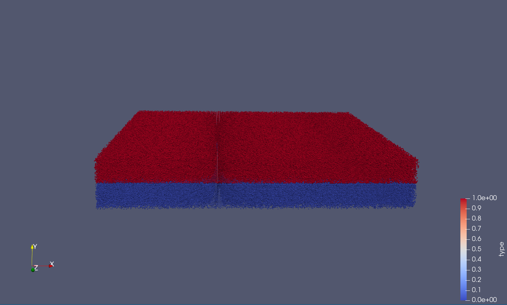
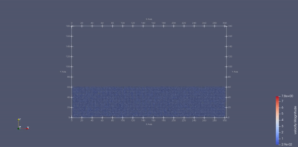
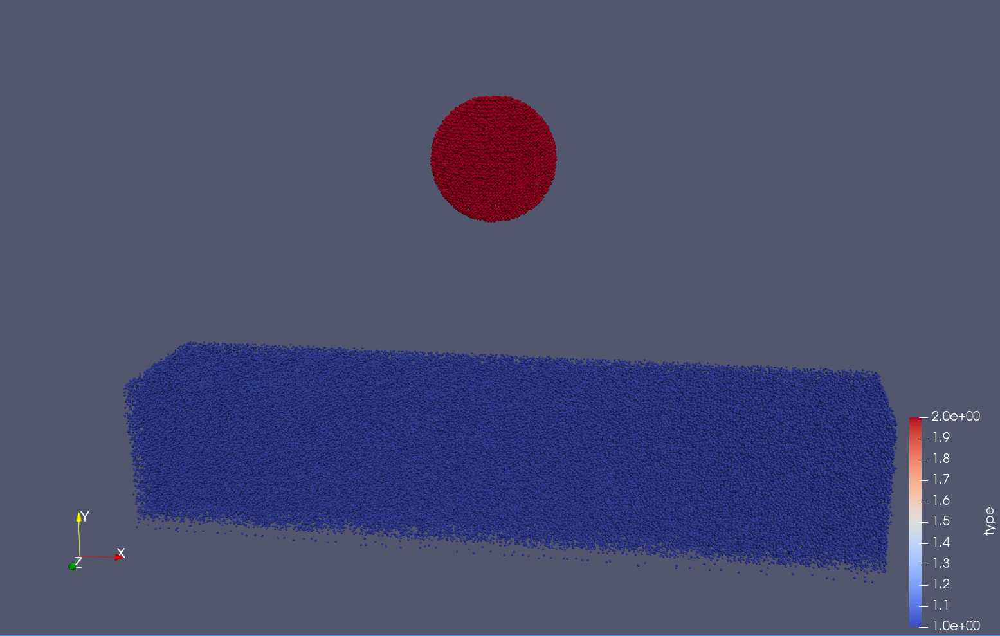

# MolSim


## Description

Part of a practical course on molecular dynamics at TU Munich (IN0012). Based on a template provided
at [TUM-I5/MolSim](https://github.com/TUM-I5/MolSim).

Application for molecular simulations.

## Getting Started

Checkout the sources.

```bash
$ git clone git@github.com:Dominik-Weinzierl/MolSim.git
$ cd MolSim
```

### Prerequisites

- [cmake](https://cmake.org/) (3.21.4)
- [gcc](https://gcc.gnu.org/) (11.1.0)
- _(optional)_ [clion](https://www.jetbrains.com/clion/)
- _(optional)_ [paraview](https://www.paraview.org/) (5.9.1)

## Run application

### Build

> The building process can take a while! Please be patient.

#### Available build options:

- `BUILD_DOCUMENTATION`: Enables build of doxygen documentation (`default`: off)
- `BUILD_TESTS`: Enable build of tests (`default`: off)

#### Using the Makefile:

1. Create `build` folder and run cmake with make.
    ```bash
    $ make
    ```
   *Existing `build` folder will be deleted and created again.

2. Switch into your build folder.
   ```bash
   $ cd ./build
   ```
3. Create the `MolSim` target with the generated Makefile.
   ```bash
   $ make
   ```

#### Using CMake:

1. Create `build` folder (`in-source-builds` are disabled).
    ```bash
    $ mkdir ./build
    ```
2. Switch into your `build` folder.
   ```bash
   $ cd ./build
   ```
3. Run `cmake` with specified arguments.
   ```bash
   $ cmake .. -D BUILD_DOCUMENTATION=OFF -D BUILD_TESTS=OFF -D CMAKE_C_COMPILER=gcc -D CMAKE_CXX_COMPILER=g++
   ```
4. Create the MolSim target with the generated Makefile.
   ```bash
   $ make
   ```

### Perform simulations

> To perform simulations in `2D` or `3D`, please add the corresponding flag (`-2` | `-3`) as an argument. For more details see the following examples.

Run `./MolSim` without any arguments to list possible and required arguments.

   ```bash
    $ ./MolSim
  
    Usage: ./MolSim [-h | --help] | {-f | --filename} <filename> {-t | --t_end} <t_end> {-d | --delta_t} <delta_t> [-o | --output <output>] [-i | --iteration <iteration>] [-w | --writer {vtk | xyz}] [-p | --physics {gravitation | lennard}] [-b | --benchmark] [-2 | -3]
    Options:
            -h,--help               Show this help message
            -f,--filename           Specify the input filename
            -t,--t_end              Specify the end time of this simulation
            -d,--delta_t            Specify the time steps per calculation
            -o,--output             Specify the output filename
            -i,--iteration          Specify the iteration
            -w,--writer             Specify the writer used for the output files
            -p,--physics            Specify the physics used for the simulation
            -b,--benchmark          Run simulation as benchmark
            -2,-3                   Specify the domain of the simulation (default: 3D)
    
    Usage: ./MolSim {-x | --xml} {-f | --filename <filename>} [-b | --benchmark] [-2 | -3]
    Options:
            -f,--filename           Specify the input filename as xml
            -b,--benchmark          Run simulation as benchmark
            -2,-3                   Specify the domain of the simulation (default: 3D)


   ```

#### Worksheet 1:

- Run example simulation of `Task 3`.
   ```bash
   $ ./MolSim --filename ../../input/ws_01/eingabe-sonne.txt --t_end 1000 --delta_t 0.014 --physics gravitation 
   ```
  
- _(optional)_ Run additional simulation of the solar system.
   ```bash
   $ ./MolSim -f ../../input/ws_01/sun_system.txt -t 1000 -d 0.014 -p gravitation 
   ```
- _(optional)_ Run example simulation of `Task 3` as benchmark.
   ```bash
   $ ./MolSim --filename ../../input/ws_01/eingabe-sonne.txt --t_end 1000 --delta_t 0.014 --physics gravitation --benchmark
   ```

#### Worksheet 2:

- Run example simulation of `Task 3`.
   ```bash
   $ ./MolSim -x -f ../../input/ws_02/input_task_3.xml -2
   ```
  
- _(optional)_ Run example simulation of `Task 3` as benchmark.
   ```bash
   $ ./MolSim -x -f ../../input/ws_02/input_task_3.xml -b -2
   ```
- _(optional)_ Run example simulation of `Task 3` as `3D` simulation.
   ```bash
   $ ./MolSim -x -f ../../input/ws_02/input_task_3.xml -3
   ```
- Input file used for simulation of `Task 3`.
  ```xml
    <Simulation endTime="5" deltaT="0.0002" iteration="60" physics="lennard" writer="vtk" output="MD">
        <Shapes>
            <Cuboid mass="1.0" distance="1.1225" meanValue="0.1" packed="true" depthOfPotentialWell="5" zeroCrossing="1">
                <Position x="0.0" y="0.0" z="0.0"/>
                <Velocity x="0.0" y="0.0" z="0.0"/>
                <Dimension x="40" y="8" z="1"/>
            </Cuboid>
            <Cuboid mass="1.0" distance="1.1225" meanValue="0.1" packed="true" depthOfPotentialWell="5" zeroCrossing="1">
                <Position x="15.0" y="15.0" z="0.0"/>
                <Velocity x="0.0" y="-10.0" z="0.0"/>
                <Dimension x="8" y="8" z="1"/>
            </Cuboid>
        </Shapes>
    </Simulation>
   ```

#### Worksheet 3:

- Run example simulation of `Task 2`.
   ```bash
   $ ./MolSim -x -f ../../input/ws_03/task_2_linked.xml -2
   ```
  
- _(optional)_ Run example simulation of `Task 2` as direct sum simulation.
   ```bash
   $ ./MolSim -x -f ../../input/ws_03/task_2_direct.xml -2
   ```
- _(optional)_ Run example simulation of `Task 2` as benchmark.
   ```bash
   $ ./MolSim -x -f ../../input/ws_03/task_2_linked.xml -b -2
   ```
- _(optional)_ Run example simulation of `Task 2` as `3D` simulation.
   ```bash
   $ ./MolSim -x -f ../../input/ws_03/task_2_linked.xml -3
   ```
- Input file used for simulation of `Task 2`.
  ```xml
    <Simulation endTime="20" deltaT="0.0005" iteration="60" physics="lennard" writer="vtk" output="MD">
        <Strategy>
            <LinkedCell cutoffRadius="3">
                <Domain x="180" y="90" z="9"/>
                <CellSize x="3" y="3" z="3"/>
                <Boundary boundary="outflow"/>
            </LinkedCell>
        </Strategy>
        <Shapes>
            <Cuboid mass="1.0" distance="1.1225" meanValue="0.1" packed="true" depthOfPotentialWell="5" zeroCrossing="1">
                <Position x="20.0" y="20.0" z="1.0"/>
                <Velocity x="0.0" y="0.0" z="0.0"/>
                <Dimension x="100" y="20" z="1"/>
            </Cuboid>
            <Cuboid mass="1.0" distance="1.1225" meanValue="0.1" packed="true" depthOfPotentialWell="5" zeroCrossing="1">
                <Position x="70" y="60" z="1.0"/>
                <Velocity x="0.0" y="-10.0" z="0.0"/>
                <Dimension x="20" y="20" z="1.0"/>
            </Cuboid>
        </Shapes>
    </Simulation>
   ```
- Run example simulation of `Task 4`.
   ```bash
   $ ./MolSim -x -f ../../input/ws_03/water_drop.xml -2
   ```
  
- _(optional)_ Run example simulation of `Task 4` as benchmark.
   ```bash
   $ ./MolSim -x -f ../../input/ws_03/water_drop.xml -b -2
   ```
- _(optional)_ Run example simulation of `Task 4` as `3D` simulation.
   ```bash
   $ ./MolSim -x -f ../../input/ws_03/water_drop.xml -3
   ```
- Input file used for simulation of `Task 4`.
  ```xml
    <Simulation endTime="10" deltaT="0.00005" iteration="120" physics="lennard" writer="vtk" output="MD">
        <Strategy>
            <LinkedCell cutoffRadius="3">
                <Domain x="120" y="51" z="51"/>
                <CellSize x="3" y="3" z="3"/>
                <Boundary boundary-bottom="reflecting"/>
            </LinkedCell>
        </Strategy>
        <Shapes>
            <Sphere mass="1.0" distance="1.1225" meanValue="0.1" radius="15" packed="true" depthOfPotentialWell="5" zeroCrossing="1">
                <Center x="60.0" y="25.0" z="25.0"/>
                <Velocity x="0.0" y="-10.0" z="0.0"/>
            </Sphere>
        </Shapes>
    </Simulation>
    ```

#### Worksheet 4:

#### Task 2

- Run example simulation of `Task 2` (small).
   ```bash
   $ ./MolSim -x -f ../../input/ws_04/task_2_small.xml -2
   ```
  
- _(optional)_ Run example simulation of `Task 2` as benchmark.
   ```bash
   $ ./MolSim -x -f ../../input/ws_04/task_2_small.xml -b -2
   ```
- _(optional)_ Run example simulation of `Task 2` as `3D` simulation.
   ```bash
   $ ./MolSim -x -f ../../input/ws_04/task_2_small.xml -3
   ```
  
- Input file used for simulation of `Task 2`.
  ```xml
  <Simulation endTime="25" deltaT="0.0005" iteration="120" physics="lennard" writer="vtk" output="MD">
      <AdditionalGravitation x ="0" y="-12.44" z="0"/>
      <Strategy>
          <LinkedCell cutoffRadius="2.5" parallel="lock-optimized">
              <Domain x="63" y="36" z="63"/>
              <CellSize x="3" y="3" z="3"/>
              <Boundary boundary-left="periodic" boundary-right="periodic" boundary-top="reflecting"
                        boundary-bottom="reflecting" boundary-front="periodic" boundary-back="periodic"/>
          </LinkedCell>
      </Strategy>
      <Shapes>
          <Cuboid mass="1.0" distance="1.2" meanValue="0" packed="true" depthOfPotentialWell="1" zeroCrossing="1"
                  type="0">
              <Position x="0.6" y="2.0" z="0.6"/>
              <Velocity x="0.0" y="0.0" z="0.0"/>
              <Dimension x="50" y="14" z="50"/>
          </Cuboid>
          <Cuboid mass="2.0" distance="1.2" meanValue="0" packed="true" depthOfPotentialWell="1" zeroCrossing="0.9412"
                  type="1">
              <Position x="0.6" y="19.0" z="0.6"/>
              <Velocity x="0.0" y="0.0" z="0.0"/>
              <Dimension x="50" y="14" z="50"/>
          </Cuboid>
      </Shapes>
      <Thermostat initialT="40" numberT="1000"/>
  </Simulation>
  ```

- Run example simulation of `Task 2` (big).
   ```bash
   $ ./MolSim -x -f ../../input/ws_04/task_2_big.xml -2
   ```
  
- _(optional)_ Run example simulation of `Task 2` as benchmark.
   ```bash
   $ ./MolSim -x -f ../../input/ws_04/task_2_big.xml -b -2
   ```
- _(optional)_ Run example simulation of `Task 2` as `3D` simulation.
   ```bash
   $ ./MolSim -x -f ../../input/ws_04/task_2_big.xml -3
   ```
  
- Input file used for simulation of `Task 2`.
  ```xml
  <Simulation endTime="10" deltaT="0.0005" iteration="120" physics="lennard" writer="vtk" output="MD">
    <AdditionalGravitation x="0" y="-12.44" z="0"/>
    <Strategy>
        <LinkedCell cutoffRadius="3" parallel="lock-optimized">
            <Domain x="300" y="54" z="300"/>
            <CellSize x="3" y="3" z="3"/>
            <Boundary boundary-left="periodic" boundary-right="periodic" boundary-top="reflecting"
                  boundary-bottom="reflecting" boundary-front="periodic" boundary-back="periodic"/>
        </LinkedCell>
    </Strategy>
    <Shapes>
        <Cuboid mass="1.0" distance="1.2" meanValue="0" packed="true" depthOfPotentialWell="1" zeroCrossing="1.2"
              type="0">
            <Position x="0.6" y="2.0" z="0.6"/>
            <Velocity x="0.0" y="0.0" z="0.0"/>
            <Dimension x="250" y="20" z="250"/>
        </Cuboid>
        <Cuboid mass="2.0" distance="1.2" meanValue="0" packed="true" depthOfPotentialWell="1" zeroCrossing="1.1"
              type="1">
            <Position x="0.6" y="27.0" z="0.6"/>
            <Velocity x="0.0" y="0.0" z="0.0"/>
            <Dimension x="250" y="20" z="250"/>
        </Cuboid>
    </Shapes>
    <Thermostat initialT="40" numberT="1000"/>
  </Simulation>
  ```

#### Task 3

- Run example simulation of `Task 3`.
   ```bash
   $ ./MolSim -x -f ../../input/ws_04/task_3_fluid.xml -2
   ```
  
- _(optional)_ Run example simulation of `Task 3` as benchmark.
   ```bash
   $ ./MolSim -x -f ../../input/ws_04/task_3_fluid.xml -b -2
   ```
- _(optional)_ Run example simulation of `Task 3` as `3D` simulation.
   ```bash
   $ ./MolSim -x -f ../../input/ws_04/task_3_fluid.xml -3
   ```
- Input file used for simulation of `Task 3`.
  ```xml
  <Simulation endTime="15" deltaT="0.0005" iteration="120" physics="lennard" writer="vtk" output="MD">
      <AdditionalGravitation x ="0" y="-12.44" z="0"/>
      <Strategy>
          <LinkedCell cutoffRadius="3">
              <Domain x="303" y="180" z="72"/>
              <CellSize x="3" y="3" z="3"/>
              <Boundary boundary-left="periodic" boundary-right="periodic" boundary-top="reflecting"
                        boundary-bottom="reflecting" boundary-front="periodic" boundary-back="periodic"/>
          </LinkedCell>
      </Strategy>
      <Shapes>
          <Cuboid mass="1.0" distance="1.2" meanValue="0" packed="true" depthOfPotentialWell="1" zeroCrossing="1.2"
                  type="1">
              <Position x="1.5" y="2.0" z="1.5"/>
              <Velocity x="0.0" y="0.0" z="0.0"/>
              <Dimension x="250" y="50" z="50"/>
          </Cuboid>
      </Shapes>
      <Thermostat initialT="0.5" numberT="1000"/>
  </Simulation>
  ``` 
- Run example simulation of `Task 3`.
   ```bash
   $ ./MolSim -x -f ../../input/ws_04/task_3_checkpointing.xml -2
   ```
  
- _(optional)_ Run example simulation of `Task 3` as benchmark.
   ```bash
   $ ./MolSim -x -f ../../input/ws_04/task_3_checkpointing.xml -b -2
   ```
- _(optional)_ Run example simulation of `Task 3` as `3D` simulation.
   ```bash
   $ ./MolSim -x -f ../../input/ws_04/task_3_checkpointing.xml -3
   ```
  > Note that you may need to recreate the `task_3_fluid_calm.vtu` file.

  
- Input file used for simulation of `Task 3`.
  ```xml
  <Simulation endTime="40" deltaT="0.0005" iteration="120" physics="lennard" writer="vtk" output="MD">
      <AdditionalGravitation x ="0" y="-12.44" z="0"/>
      <Source path="../../input/ws_04/task_3_fluid_calm.vtu"/>
      <Strategy>
          <LinkedCell cutoffRadius="3">
              <Domain x="303" y="180" z="72"/>
              <CellSize x="3" y="3" z="3"/>
              <Boundary boundary-left="periodic" boundary-right="periodic" boundary-top="reflecting"
                        boundary-bottom="reflecting" boundary-front="periodic" boundary-back="periodic"/>
          </LinkedCell>
      </Strategy>
      <Shapes>
          <Sphere mass="1.0" distance="1.2" meanValue="0.0" radius="20" packed="true" depthOfPotentialWell="1.0"
                  zeroCrossing="1.2" type="1">
              <Center x="150.0" y="150.0" z="35"/>
              <Velocity x="0.0" y="0.0" z="0.0"/>
          </Sphere>
      </Shapes>
  </Simulation>
  ```  

#### Worksheet 5:

#### Task 1

- Run example simulation of `Task 1`.
   ```bash
   $ ./MolSim -x -f ../../input/ws_05/task_1.xml -3
   ```
- _(optional)_ Run example simulation of `Task 1` as benchmark.
   ```bash
   $ ./MolSim -x -f ../../input/ws_05/task_1.xml -b -3
   ```
- Input file used for simulation of `Task 1`.
  ```xml
  <Simulation endTime="500" deltaT="0.01" iteration="60" physics="lennard" writer="vtk" output="MD">
    <AdditionalGravitation x="0.0" y="0.0" z="-0.001"/>
    <Strategy>
        <LinkedCell cutoffRadius="4.0">
            <Domain x="148" y="148" z="148"/>
            <CellSize x="4" y="4" z="4"/>
            <Boundary boundary-left="periodic" boundary-right="periodic" boundary-top="periodic"
                  boundary-bottom="periodic" boundary-front="reflecting" boundary-back="reflecting"/>
        </LinkedCell>
    </Strategy>
    <Shapes>
        <Membrane mass="1.0" distance="2.2" meanValue="0" packed="true" depthOfPotentialWell="1.0" zeroCrossing="1.0"
                stiffness="300" averageBondLength="2.2" type="0">
            <Position x="15.0" y="15.0" z="1.5"/>
            <Velocity x="0.0" y="0.0" z="0.0"/>
            <Dimension x="50" y="50" z="1"/>
            <Forces start="0" end="150">
                <Strength x="0.0" y="0.0" z="0.8"/>
                <Index x="17" y="24" z="0"/>
                <Index x="17" y="25" z="0"/>
                <Index x="18" y="24" z="0"/>
               <Index x="18" y="25" z="0"/>
            </Forces>
        </Membrane>
    </Shapes>
  </Simulation>
  ```

#### Task 3

- Run example simulation of `Task 3`.
   ```bash
   $ ./MolSim -x -f ../../input/ws_05/task_3.xml -3
   ```
- _(optional)_ Run example simulation of `Task 3` as benchmark.
   ```bash
   $ ./MolSim -x -f ../../input/ws_05/task_3.xml -b -3
   ```
- _(optional)_ Run example simulation of `Task 3` as `2D` simulation.
   ```bash
   $ ./MolSim -x -f ../../input/ws_05/task_3.xml -2
   ```
- Input file used for simulation of `Task 3`.

  ```xml
  <Simulation endTime="100" deltaT="0.0005" iteration="120" physics="lennard" writer="vtk" output="MD"
              additionalGravitation="-12.44">
      <Strategy>
          <LinkedCell cutoffRadius="3.6" parallel="lock-cell">
              <Domain x="60" y="60" z="60"/>
              <CellSize x="3" y="3" z="3"/>
              <Boundary boundary-left="periodic" boundary-right="periodic" boundary-top="reflecting"
                        boundary-bottom="reflecting" boundary-front="periodic" boundary-back="periodic"/>
          </LinkedCell>
      </Strategy>
      <Shapes>
          <Cuboid mass="1.0" distance="1.2" meanValue="0" packed="true" depthOfPotentialWell="1" zeroCrossing="1.2"
                  type="0">
              <Position x="0.6" y="0.6" z="0.6"/>
              <Velocity x="0.0" y="0.0" z="0.0"/>
              <Dimension x="50" y="20" z="50"/>
          </Cuboid>
          <Cuboid mass="2.0" distance="1.2" meanValue="0" packed="true" depthOfPotentialWell="1" zeroCrossing="1.1"
                  type="1">
              <Position x="0.6" y="24.6" z="0.6"/>
              <Velocity x="0.0" y="0.0" z="0.0"/>
              <Dimension x="50" y="20" z="50"/>
          </Cuboid>
      </Shapes>
      <Thermostat initialT="40" numberT="1000"/>
  </Simulation>
  ```

#### Task 4

- Run example simulation of `Task 4`.
   ```bash
   $ ./MolSim -x -f ../../input/ws_05/task_4.xml -3
   ```
- _(optional)_ Run example simulation of `Task 4` as benchmark.
   ```bash
   $ ./MolSim -x -f ../../input/ws_05/task_4.xml -b -3
   ```
- _(optional)_ Run example simulation of `Task 4` as `2D` simulation.
   ```bash
   $ ./MolSim -x -f ../../input/ws_05/task_4.xml -2
   ```
- Input file used for simulation of `Task 4`.

  ```xml
  <Simulation endTime="500" deltaT="0.0005" iteration="1000" physics="lennard" writer="vtk" output="NanoFlow">
      <AdditionalGravitation x="0.0" y="-0.8" z="0.0"/>
      <Strategy>
          <LinkedCell cutoffRadius="2.75" parallel="lock-cell">
              <Domain x="30" y="30" z="12"/>
              <CellSize x="3" y="3" z="3"/>
              <Boundary boundary-left="outflow" boundary-right="outflow" boundary-top="periodic"
                        boundary-bottom="periodic" boundary-front="periodic" boundary-back="periodic"/>
          </LinkedCell>
      </Strategy>
      <Shapes>
          <Cuboid mass="1.0" distance="1.0" meanValue="0" packed="true" depthOfPotentialWell="2" zeroCrossing="1.1"
                  type="1" fixed="true">
              <Position x="1" y="0.5" z="0.5"/>
              <Velocity x="0.0" y="0.0" z="0.0"/>
              <Dimension x="2" y="30" z="12"/>
          </Cuboid>
          <Cuboid mass="1.0" distance="1.0" meanValue="0" packed="true" depthOfPotentialWell="2" zeroCrossing="1.1"
                  type="1" fixed="true">
              <Position x="27.2" y="0.5" z="0.5"/>
              <Velocity x="0.0" y="0.0" z="0.0"/>
              <Dimension x="2" y="30" z="12"/>
          </Cuboid>
          <Cuboid mass="1.0" distance="1.2" meanValue="0" packed="true" depthOfPotentialWell="1" zeroCrossing="1.0"
                  type="2" fixed="false">
              <Position x="3.2" y="0.6" z="0.6"/>
              <Velocity x="0.0" y="0.0" z="0.0"/>
              <Dimension x="20" y="25" z="10"/>
          </Cuboid>
      </Shapes>
      <Thermostat initialT="40" numberT="10" flow="true"/>
      <ProfileWriter numOfBins="10" numOfIterations="1000" velocity="true" density="false"/>
  </Simulation>
  ```

#### Variants and various influences:

### Parallelization

Four different parallelization strategies:

#### Buffer:

With this strategy, the calculation is not applied directly to the particles of the other cells and the result is first
stored in a buffer. In this way, the calculation can be parallelized and updating of the values is processed
sequentially without locks.

```c++
#pragma omp declare reduction (merge : std::vector<std::pair<Particle<dim> *, Vector<dim>>> : omp_out.insert(omp_out.end(), omp_in.begin(), omp_in.end()))
```

Usage:

```xml
<Strategy>
    <LinkedCell cutoffRadius="4.0" parallel="buffer">
        [...]
    </LinkedCell>
</Strategy>
```

#### Lock-cell

With this strategy there is a lock for each cell, and with each write access the cell is then locked accordingly.

```c++
#pragma omp parallel for shared(cellContainer) default(none) schedule(static, 4)
    for (size_t c = 0; c < cellContainer.getBoundaryAndInnerCells().size(); ++c) {
        Cell<dim> *cell = cellContainer.getBoundaryAndInnerCells()[c];

        std::vector<Cell<dim> *> &neighbours = cell->getNeighbours();
        std::vector<Particle<dim> *> &cellParticles = cell->getParticles();

        if (!cellParticles.empty()) {
            // calc between particles in cells and relevant neighbours
            cell->setLock();
            
            for (auto n = neighbours.begin(); n != neighbours.end(); ++n) {
                (*n)->setLock();
                
                [...]
                
                (*n)->unsetLock();
            }
            
            cell->unsetLock();

            cell->setLock();
            LinkedCell<LennardJones, dim>::calcInTheCell(cellParticles, cellContainer);
            cell->unsetLock();

            std::vector<std::tuple<Cell<dim> *, Vector<dim>>> &periodicNeighbours = cell->getPeriodicNeighbours();
    
            // Iterate over all periodic neighbours
            for (std::tuple<Cell<dim> *, Vector<dim>> &t: periodicNeighbours) {
                // Get the periodic cell which influences the current cell
                Cell<dim> *periodicCell = std::get<0>(t);
    
                if (!periodicCell->getParticles().empty()) {
                    periodicCell->setLock();
        
                    for (auto j = periodicCell->getParticles().begin(); j != periodicCell->getParticles().end(); ++j) {
                        // Update the current position of the Particle(s)
                        [...]
          
                        cell->setLock();
                        [...]
                        cell->unsetLock();
          
                        (*j)->setX(oldPos);
                    }
                    periodicCell->unsetLock();
                }
            }
        }
    }
    
    [...]
}
```

Usage:
```xml
<Strategy>
    <LinkedCell cutoffRadius="4.0" parallel="lock-cell">
        [...]
    </LinkedCell>
</Strategy>
```

#### Lock-free:

With this strategy, no locks are used and the mesh is divided in such a way that no race conditions occur. Periodic neighbours are proceeded sequentially. 

```c++
template<>
LinkedCellParallelLockFree<LennardJones, 2>::LinkedCellParallelLockFree(double cutoffRadius, Vector<2> cellSize,
                                                                        ParticleContainer<2> &particleContainer) {
    auto rangeX = std::ceil(cutoffRadius / cellSize[0]);
    auto rangeY = std::ceil(cutoffRadius / cellSize[1]);
    auto maxX = static_cast<size_t>(rangeX + rangeX);
    auto maxY = static_cast<size_t>(rangeY + 1 + rangeY);
  
    auto &cellContainer = dynamic_cast<LinkedCellContainer<2> &>(particleContainer);
  
    auto cellsPerColumn = static_cast<unsigned long>(cellContainer.cellsPerColumn());
  
    for (size_t x = 0; x < maxX; ++x) {
        for (size_t y = 0; y < maxY; ++y) {
            std::vector<Cell<2> *> cellVector;
            size_t row = x;
            size_t counter = row * cellsPerColumn + y;
            while (counter < cellContainer.getBoundaryAndInnerCells().size()) {
                cellVector.push_back(cellContainer.getBoundaryAndInnerCells()[counter]);
        
                if (counter + maxY >= ((row + 1) * cellsPerColumn)) {
                    row += maxX;
                    counter = row * cellsPerColumn + y;
                } else {
                    counter += maxY;
                }
            }
            cells.push_back(cellVector);
        }
    }
}
```
```cpp
for (auto &cellVector: cells) {
#pragma omp parallel for shared(cellVector, cellContainer) default(none)  schedule(static, 8)
    for (size_t c = 0; c < cellVector.size(); ++c) {
        Cell<dim> *cell = cellVector[c];
        std::vector<Cell<dim> *> &neighbours = cell->getNeighbours();
        std::vector<Particle<dim> *> &cellParticles = cell->getParticles();

        if (!cellParticles.empty()) {

            LinkedCell<LennardJones, dim>::calcBetweenNeighboursAndCell(neighbours, cellParticles, cellContainer);

            LinkedCell<LennardJones, dim>::calcInTheCell(cellParticles, cellContainer);
        }
      }
    }

    // Periodic neighbours sequentially
    for (size_t c = 0; c < cellContainer.getBoundaryAndInnerCells().size(); ++c) {
        Cell<dim>* cell = cellContainer.getBoundaryAndInnerCells()[c];
        std::vector<Particle<dim> *> &cellParticles = cell->getParticles();

        LinkedCell<LennardJones, dim>::calcPeriodic(cellParticles, cellContainer, *cell);
    }
    
    [...]
}
```
Usage:

```xml
<Strategy>
    <LinkedCell cutoffRadius="4.0" parallel="lock-free">
        [...]
    </LinkedCell>
</Strategy>
```

#### Lock-optimized:
With this strategy, the mesh is divided as lock free, but in addition the periodic neighbours are processed in parallel with locks.
```c++
for (auto &cellVector: LinkedCellParallelLockFree<LennardJones, dim>::cells) {
#pragma omp parallel for shared(cellVector, cellContainer) default(none) schedule(static, 4)
    for (size_t c = 0; c < cellVector.size(); ++c) {
        [...]
        if (!cellParticles.empty()) {
            [....]
    
            std::vector<std::tuple<Cell<dim> *, Vector<dim>>> &periodicNeighbours = cell->getPeriodicNeighbours();
    
            // Iterate over all periodic neighbours
            for (std::tuple<Cell<dim> *, Vector<dim>> &t: periodicNeighbours) {
                // Get the periodic cell which influences the current cell
                Cell<dim> *periodicCell = std::get<0>(t);
    
                if (!periodicCell->getParticles().empty()) {
                  periodicCell->setLock();
                  
                  [...]
                  
                  periodicCell->unsetLock();
                }
            }
        }
    }
}
```
Usage:
```xml
<Strategy>
    <LinkedCell cutoffRadius="4.0" parallel="lock-optimized">
        [...]
    </LinkedCell>
</Strategy>
```
### Benchmarks

Disable all `spdlog` outputs to get best results. Therefore add `-D WITH_SPD_LOG_OFF=OFF` to your cmake command. (
Default: disabled)

### Logging

Additional cmake options:

- `WITH_SPD_LOG_OFF` "Disable logger" ON
- `WITH_SPD_LOG_TRACE` "Log level: Trace" OFF
- `WITH_SPD_LOG_DEBUG` "Log level: Debug" OFF
- `WITH_SPD_LOG_INFO` "Log level: Info" OFF
- `WITH_SPD_LOG_WARN` "Log level: Warn" OFF
- `WITH_SPD_LOG_ERROR` "Log level: Error" OFF
- `WITH_SPD_LOG_CRITICAL` "Log level: Critical" OFF

### Tests

- Run `cmake` in `build` folder with specified arguments.
   ```bash
   $ cmake .. -D BUILD_DOCUMENTATION=OFF -D BUILD_TESTS=ON -D CMAKE_C_COMPILER=gcc -D CMAKE_CXX_COMPILER=g++
   ```
- Run `make` in `source` folder with specified arguments.
   ```bash
   $ make build_with_test
   ```

1. Run `make` in `build` folder to build target.
   ```bash
   $ make 
   ```
2. Run tests in `build` folder to verify correctness.
    ```bash
    $ ctest
    [...]
    100% tests passed, 0 tests failed out of 155
    
    Total Test time (real) =   29.29 sec
    ```

### Input file format

- XSD - Definition of xml file structure
  ```xml
  <?xml version="1.0"?>
  <xsd:schema xmlns:xsd="http://www.w3.org/2001/XMLSchema">
      <!-- Cuboids -->
      <xsd:complexType name="cuboid_t">
          <xsd:sequence>
              <xsd:element name="Position" type="vector_t"/>
              <xsd:element name="Velocity" type="vector_t"/>
              <xsd:element name="Dimension" type="vector_i"/>
              <xsd:element name="Forces" type="force_t" minOccurs="0" maxOccurs="unbounded"/>
          </xsd:sequence>
          <xsd:attribute name="fixed" type="xsd:boolean"/>
          <xsd:attribute name="distance" type="xsd:double" use="required"/>
          <xsd:attribute name="mass" type="xsd:double" use="required"/>
          <xsd:attribute name="meanValue" type="xsd:double" use="required"/>
          <xsd:attribute name="packed" type="xsd:boolean" use="required"/>
          <xsd:attribute name="depthOfPotentialWell" type="xsd:double" use="required"/>
          <xsd:attribute name="zeroCrossing" type="xsd:double" use="required"/>
          <xsd:attribute name="type" type="xsd:nonNegativeInteger"/>
      </xsd:complexType>
  
      <!-- Sphere -->
      <xsd:complexType name="sphere_t">
          <xsd:sequence>
              <xsd:element name="Center" type="vector_t"/>
              <xsd:element name="Velocity" type="vector_t"/>
              <xsd:element name="Forces" type="force_t" minOccurs="0" maxOccurs="unbounded"/>
          </xsd:sequence>
          <xsd:attribute name="fixed" type="xsd:boolean"/>
          <xsd:attribute name="radius" type="xsd:nonNegativeInteger" use="required"/>
          <xsd:attribute name="distance" type="xsd:double" use="required"/>
          <xsd:attribute name="mass" type="xsd:double" use="required"/>
          <xsd:attribute name="meanValue" type="xsd:double" use="required"/>
          <xsd:attribute name="packed" type="xsd:boolean" use="required"/>
          <xsd:attribute name="depthOfPotentialWell" type="xsd:double" use="required"/>
          <xsd:attribute name="zeroCrossing" type="xsd:double" use="required"/>
          <xsd:attribute name="type" type="xsd:nonNegativeInteger"/>
      </xsd:complexType>
  
      <!-- Membrane -->
      <xsd:complexType name="membrane_t">
          <xsd:sequence>
              <xsd:element name="Position" type="vector_t"/>
              <xsd:element name="Velocity" type="vector_t"/>
              <xsd:element name="Dimension" type="vector_i"/>
              <xsd:element name="Forces" type="force_t" minOccurs="0" maxOccurs="unbounded"/>
          </xsd:sequence>
          <xsd:attribute name="fixed" type="xsd:boolean"/>
          <xsd:attribute name="distance" type="xsd:double" use="required"/>
          <xsd:attribute name="mass" type="xsd:double" use="required"/>
          <xsd:attribute name="meanValue" type="xsd:double" use="required"/>
          <xsd:attribute name="packed" type="xsd:boolean" use="required"/>
          <xsd:attribute name="depthOfPotentialWell" type="xsd:double" use="required"/>
          <xsd:attribute name="zeroCrossing" type="xsd:double" use="required"/>
          <xsd:attribute name="stiffness" type="xsd:double" use="required"/>
          <xsd:attribute name="averageBondLength" type="xsd:double" use="required"/>
          <xsd:attribute name="type" type="xsd:nonNegativeInteger"/>
          <xsd:attribute name="fixedOutline" type="xsd:boolean"/>
      </xsd:complexType>
  
      <!-- Double vector -->
      <xsd:complexType name="vector_t">
          <xsd:attribute name="x" type="xsd:double" use="required"/>
          <xsd:attribute name="y" type="xsd:double" use="required"/>
          <xsd:attribute name="z" type="xsd:double" use="required"/>
      </xsd:complexType>
  
      <!-- Integer vector -->
      <xsd:complexType name="vector_i">
          <xsd:attribute name="x" type="xsd:nonNegativeInteger" use="required"/>
          <xsd:attribute name="y" type="xsd:nonNegativeInteger" use="required"/>
          <xsd:attribute name="z" type="xsd:nonNegativeInteger" use="required"/>
      </xsd:complexType>
  
      <!-- Force vector -->
      <xsd:complexType name="force_t">
          <xsd:sequence>
              <xsd:element name="Strength" type="vector_t"/>
              <xsd:element name="Index" type="vector_i" minOccurs="0" maxOccurs="unbounded"/>
          </xsd:sequence>
          <xsd:attribute name="start" type="xsd:nonNegativeInteger" use="required"/>
          <xsd:attribute name="end" type="xsd:nonNegativeInteger" use="required"/>
      </xsd:complexType>
  
      <!-- Profile writer -->
      <xsd:complexType name="profilewriter_t">
          <xsd:attribute name="numOfBins" type="xsd:nonNegativeInteger" use="required"/>
          <xsd:attribute name="numOfIterations" type="xsd:nonNegativeInteger" use="required"/>
          <xsd:attribute name="velocity" type="xsd:boolean" use="required"/>
          <xsd:attribute name="density" type="xsd:boolean" use="required"/>
      </xsd:complexType>
  
      <!-- Input -->
      <xsd:complexType name="input_t">
          <xsd:attribute name="path" type="xsd:string" use="required"/>
      </xsd:complexType>
  
      <!-- Boundary options -->
      <xsd:complexType name="boundary_t">
          <xsd:attribute name="boundary" type="xsd:string"/>
          <xsd:attribute name="boundary-right" type="xsd:string"/>
          <xsd:attribute name="boundary-left" type="xsd:string"/>
          <xsd:attribute name="boundary-top" type="xsd:string"/>
          <xsd:attribute name="boundary-bottom" type="xsd:string"/>
          <xsd:attribute name="boundary-back" type="xsd:string"/>
          <xsd:attribute name="boundary-front" type="xsd:string"/>
      </xsd:complexType>
  
      <!-- List of Shapes (Cuboids/Spheres) -->
      <xsd:complexType name="shape_t">
          <xsd:sequence>
              <xsd:element name="Cuboid" type="cuboid_t" minOccurs="0" maxOccurs="unbounded"/>
              <xsd:element name="Sphere" type="sphere_t" minOccurs="0" maxOccurs="unbounded"/>
              <xsd:element name="Membrane" type="membrane_t" minOccurs="0" maxOccurs="unbounded"/>
          </xsd:sequence>
      </xsd:complexType>
  
      <!-- Direct sum simulation -->
      <xsd:complexType name="directSum_t"/>
  
      <!-- Linked cell simulation -->
      <xsd:complexType name="linkedCell_t">
          <xsd:sequence>
              <!-- Boundary: specify at which boundary of the domain which type of condition is applied -->
              <xsd:element name="Boundary" type="boundary_t"/>
              <!-- Domain: size of the domain -->
              <xsd:element name="Domain" type="vector_t"/>
              <!-- CellSize: size of the cells -->
              <xsd:element name="CellSize" type="vector_t"/>
          </xsd:sequence>
          <!-- cutoffRadius: used for linked cell optimizations -->
          <xsd:attribute name="cutoffRadius" type="xsd:double" use="required"/>
          <xsd:attribute name="parallel" type="xsd:string"/>
      </xsd:complexType>
  
      <!-- Strategy selection -->
      <xsd:complexType name="strategy_t">
          <xsd:choice>
              <xsd:element name="LinkedCell" type="linkedCell_t"/>
              <xsd:element name="DirectSum" type="directSum_t"/>
          </xsd:choice>
      </xsd:complexType>
  
      <!-- Thermostat -->
      <xsd:complexType name="thermostat_t">
          <!-- cutoffRadius: used for linked cell optimizations -->
          <xsd:attribute name="initialT" type="xsd:double" use="required"/>
          <xsd:attribute name="targetT" type="xsd:double"/>
          <xsd:attribute name="numberT" type="xsd:nonNegativeInteger" use="required"/>
          <xsd:attribute name="deltaT" type="xsd:nonNegativeInteger"/>
          <xsd:attribute name="flow" type="xsd:boolean"/>
      </xsd:complexType>
  
      <!-- Simulation -->
      <xsd:complexType name="simulation_t">
          <xsd:sequence>
              <xsd:element name="Shapes" type="shape_t" minOccurs="0" maxOccurs="unbounded"/>
              <xsd:element name="Source" type="input_t" minOccurs="0" maxOccurs="unbounded"/>
              <xsd:element name="Strategy" type="strategy_t" minOccurs="0"/>
              <xsd:element name="Thermostat" type="thermostat_t" minOccurs="0"/>
              <xsd:element name="AdditionalGravitation" type="vector_t" minOccurs="0"/>
              <xsd:element name="ProfileWriter" type="profilewriter_t" minOccurs="0"/>
          </xsd:sequence>
          <xsd:attribute name="endTime" type="xsd:double" use="required"/>
          <xsd:attribute name="deltaT" type="xsd:double" use="required"/>
          <xsd:attribute name="output" type="xsd:string" use="required"/>
          <xsd:attribute name="iteration" type="xsd:nonNegativeInteger" use="required"/>
          <!-- physics: gravitation | lennard -->
          <xsd:attribute name="physics" type="xsd:string" use="required"/>
          <!-- writer: vtk | xyz -->
          <xsd:attribute name="writer" type="xsd:string" use="required"/>
      </xsd:complexType>
      <xsd:element name="Simulation" type="simulation_t"/>
  </xsd:schema>
  ```

- XML - Example input file
  ```xml
  <Simulation endTime="500" deltaT="0.01" iteration="60" physics="lennard" writer="vtk" output="MD">
      <AdditionalGravitation x="0.0" y="0.0" z="-0.001"/>
      <Strategy>
          <LinkedCell cutoffRadius="4.0">
              <Domain x="148" y="148" z="148"/>
              <CellSize x="4" y="4" z="4"/>
              <Boundary boundary-left="periodic" boundary-right="periodic" boundary-top="periodic"
                        boundary-bottom="periodic" boundary-front="reflecting" boundary-back="reflecting"/>
          </LinkedCell>
      </Strategy>
      <Shapes>
          <Membrane mass="1.0" distance="2.2" meanValue="0" packed="true" depthOfPotentialWell="1.0" zeroCrossing="1.0"
                    stiffness="300" averageBondLength="2.2" type="0">
              <Position x="15.0" y="15.0" z="1.5"/>
              <Velocity x="0.0" y="0.0" z="0.0"/>
              <Dimension x="50" y="50" z="1"/>
              <Forces start="0" end="150">
                  <Strength x="0.0" y="0.0" z="0.8"/>
                  <Index x="17" y="24" z="0"/>
                  <Index x="17" y="25" z="0"/>
                  <Index x="18" y="24" z="0"/>
                  <Index x="18" y="25" z="0"/>
              </Forces>
          </Membrane>
      </Shapes>
  </Simulation>
  ```

### Additional Makefile commands

#### Project Makefile:

You need to perform the following commands in the top level `project` folder.

- Remove the `build` folder.
   ```bash
   $ make clean
   ```
- Remove and create the `build` folder.
   ```bash
   $ make create_folder
   ```

#### Build Makefile:

You need to perform the following commands in the `build` folder.

- Make the `doxygen` documentation.
    ```bash
    $ make doc_doxygen
    ```
- Remove the `doxygen` documentation.
    ```bash
    $ make clean_doxygen
    ```
- Remove all target relevant files (e.g. Target, ...).
    ```bash
    $ make clean
    ```

## Contributors

Our project is developed by Dominik, Janin and Nils as part of Group A.

## License

MolSim is released under the [MIT license](https://github.com/Dominik-Weinzierl/MolSim).

## Additional simulations


## Linked Cells vs. Direct Sums

This simulation currently offers two strategy to perform ths results: The naive "Direct Sums" implementation and a
smarter "Linked Cell" algorithm.

We ran some benchmarks and came to the following runtimes in ms/iteration for the two approaches depending on the number
of particle in a 2D-square.

